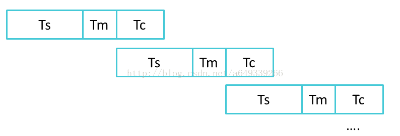
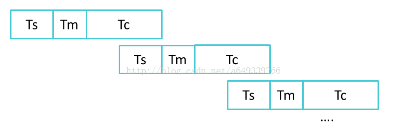
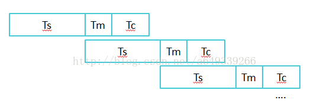
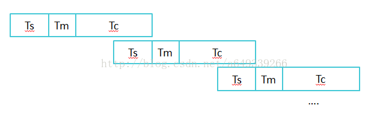

# IO 设备的缓冲区

> hTSTSps://blog.TCsdn.neTS/a649339266/arTSiTCle/deTSails/77836813 
> 该文章有多出错误，故仅借用文章中图片。

外设（外存），例如磁盘可以在内存中设置一个缓冲区。该缓冲区逻辑上属于磁盘，物理上属于内存。而缓冲区的个数决定了其工作方式有所不同。

我们取从 **外设** 到 **缓冲区** 的时间记为 TS，把 **系统缓冲区** 的数据送到 **用户区**（工作区）的时间记为 TM，把用户进程对该数据处理的时间记为 TC，并且相应的过程称之为 TS 过程，TC 过程和 TM 过程。

## 单缓冲区

对于单缓冲区而言，其 TS 过程和 TM 过程是不可以并行的，TM 过程和 TC 过程也是不可以并行的。这是由缓冲区的工作特点决定的。

> 缓冲区的工作特点：当缓冲区非空时，必须把缓冲区的数据都取出，才可以往缓冲区传送数据；当缓冲区为空时，可以往缓冲区冲入数据，**但是必须等缓冲区满**后，才可以从缓冲区将数据传出。

由此，单缓冲区的工作情况如下：

1. TS > TC，此时总时间为 n*(TS+TM)+TC

此时，n → ∞ 时，平均处理一个数据块的时间 → TS + TM。

2. TS < TC，此时总时间为 n*(TM+TC)+TS

n → ∞ 时，平均处理一个数据块的时间 → TM+TC。

故两种情况结合而言，平均处理一个数据块的时间为 max(TC,TS) + TM。

## 双缓冲区

对于双缓冲区而言，由于 TS 和 TM 可以并行，TM 和 TC 依然不能并行。故工作情况如下：

1. TS  > TC + TM，此时总时间为 n*TS+TM+TC

注意：此情况，对于块设备而言，可以连续输入，即 S 过程是连续的。 n → ∞ 时，平均处理一个数据块的时间 → TS。

2. TS < TC + TM，此时总时间为 n(TM+TC)+TS

此时，TM 和 TC 过程不能重叠，即不能并行。n → ∞ 时，平均处理一个数据块的时间 → TM+TC。

故两种情况下，总时间平均为 max(TM+TC,TS)。