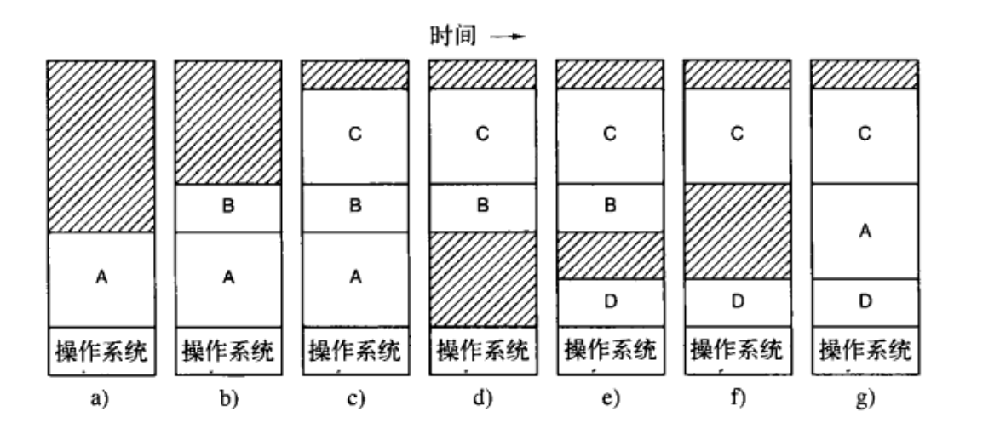
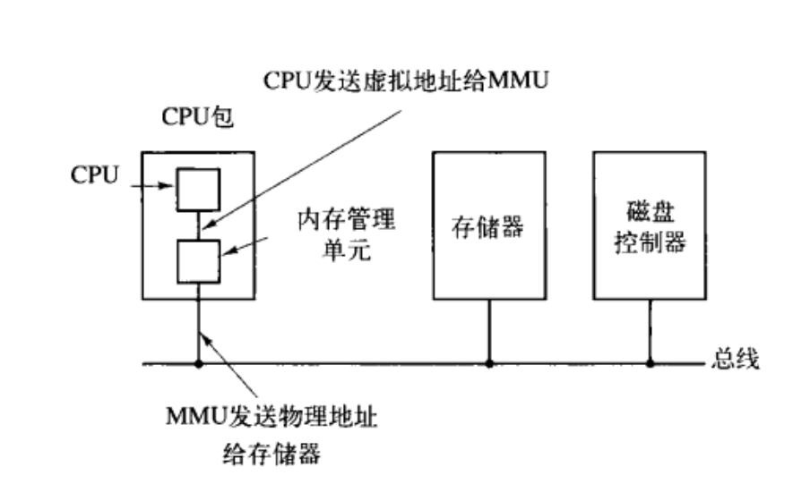
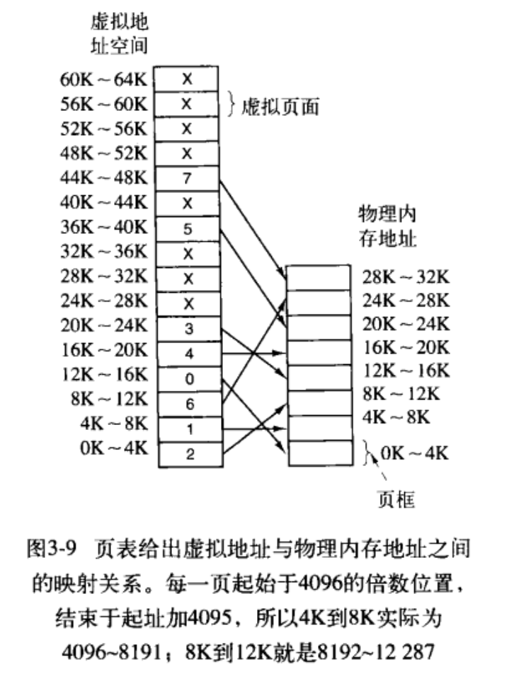
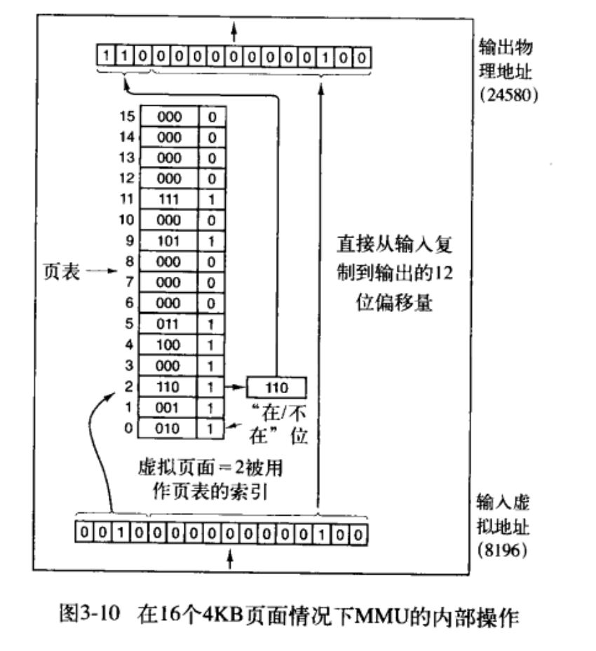

<a id="markdown-1-存储管理" name="1-存储管理"></a>
# 1. 存储管理
<!-- TOC -->

- [1. 存储管理](#1-存储管理)
    - [1.1. 内存的管理](#11-内存的管理)
        - [1.1.1. 无存储器抽象](#111-无存储器抽象)
        - [1.1.2. 一种存储器抽象：地址空间](#112-一种存储器抽象地址空间)
            - [1.1.2.1. 基址寄存器和界限寄存器](#1121-基址寄存器和界限寄存器)
        - [1.1.3. 交换技术](#113-交换技术)
            - [1.1.3.1. 空闲内存管理](#1131-空闲内存管理)
        - [1.1.4. 虚拟内存](#114-虚拟内存)
            - [1.1.4.1. 分页](#1141-分页)
            - [1.1.4.2. 页表](#1142-页表)
                - [1.1.4.2.1. 页表项的结构](#11421-页表项的结构)
        - [1.1.5. 页面置换算法](#115-页面置换算法)
            - [1.1.5.1. 最优页面置换算法](#1151-最优页面置换算法)
            - [1.1.5.2. 最近未使用页面置换算法](#1152-最近未使用页面置换算法)
            - [1.1.5.3. 先进先出页面置换算法](#1153-先进先出页面置换算法)
            - [1.1.5.4. 第二次机会页面置换算法](#1154-第二次机会页面置换算法)
            - [1.1.5.5. 时钟页面置换算法](#1155-时钟页面置换算法)
            - [1.1.5.6. 最近最少使用页面置换算法](#1156-最近最少使用页面置换算法)

<!-- /TOC -->
内存资源是有限的，这里又涉及到『内存虚拟化』的概念。

**分层存储体系**：一般可以分为寄存器（register），高速缓存（cache）、主存、磁盘缓存、磁盘、可移动存储介质等。或者更简单一点：cache→主存→外部存储（包含 磁盘，SSD，U 盘，光盘等外部存储器件）。操作系统的工作是**将这个存储体系抽象（虚拟化）为一个有用的模型并管理这个抽象模型**。

> 严格意义上，主存和内存的关系，目前接受度较高的名词解释和关系如下图。 [电脑的主存储器和主存、内存的关系是什么？ - 乔乔-缩头者的回答 - 知乎](https://www.zhihu.com/question/28445273/answer/143956523)


> 从计算机体系结构的视角来看，存储结构如下图所示。


其中，寄存器、高速缓存、内存、磁盘缓存等属于操作系统『存储管理』的管理范畴，断电后信息不再存在。固定磁盘和可移动存储介质属于『设备管理』的管理范畴，它们存储的信息将被长期保存。:exclamation:  更准确点来说，其中寄存器、cache 等最底层的管理由硬件负责，并不由操作系统负责。

**存储管理器**：操作系统中负责管理『分层存储器体系』的部分。其任务有，如记录哪些内存正在使用，哪些内存是空闲的；进程需要时为其分配内存，进程使用完后释放内存。

<a id="markdown-11-内存的管理" name="11-内存的管理"></a>
## 1.1. 内存的管理

内存的管理方案也是经过了以此改进。

<a id="markdown-111-无存储器抽象" name="111-无存储器抽象"></a>
### 1.1.1. 无存储器抽象

无抽象，即没有任何对存储器模型的抽象（虚拟化），具体表现为，每一个程序都直接访问物理内存。如
```asm
MOV REGISTER1,1000      -- 将位置为 1000 的物理内存的内容移到 REGISTER1 中
```
直接访问物理内存，没有进行任何抽象，就是将物理内存划分的地址：从 0 到某个上限的物理地址空间。然后直接访问。

此时会出现第一个问题：内存中如何同时运行两个程序？比如第一个程序在 2000 位置写入一个新值，将会擦掉第二个程序放在相同位置的所有内容。

- 如果想要运行两个程序呢（当然同一时刻依然是运行一个程序，因为内存只能加载一个程序）？比如此时运行 A，想要运行 B。
    这个时候，就需要将新程序 B 从磁盘上加载到内存中，覆盖掉第一个程序 A。如果想再次运行 A，就要重新加载 A。

- 在没有内存抽象的系统中实现并行，一个简单的方法，即多线程并行。因为线程是共享进程资源的。但是这个方法显然没有从根本上解决上面的问题的。

<a id="markdown-112-一种存储器抽象地址空间" name="112-一种存储器抽象地址空间"></a>
### 1.1.2. 一种存储器抽象：地址空间

从现代角度来看，物理地址暴露给进程容易引发各类严重问题，如
- 用户程序，可以很容易（故意或偶然）地破坏操作系统
- 直接使用物理地址，想要同时（如果单 CPU 就轮流运行）运行多个程序是很困难的（**理论上来说**，只要两个程序访问的物理地址完全没有冲突也是可以的，实际上是非常困难的）。

**地址空间**就是对内存的一种抽象。即内存的虚拟化，类似于进程概念中的 CPU 虚拟化。『地址空间』是一个进程可用于寻址内存的一套地址集合。每个进程都有一个自己的地址空间，各个进程的地址空间是独立的（当然，进程也可以共享地址空间）。


有了地址空间（虚拟/抽象的空间），就需要虚拟的地址空间到物理地址的映射/转换。

<a id="markdown-1121-基址寄存器和界限寄存器" name="1121-基址寄存器和界限寄存器"></a>
#### 1.1.2.1. 基址寄存器和界限寄存器

最简单的就是**动态重定位**，即将每个进程的地址空间映射到物理内存的不同部分。实现『动态重定位』的最经典方法就是给每个 CPU 配置两个特殊的硬件寄存器，即**基址寄存器**和**界限寄存器**。当一个进程运行时，程序的起始物理地址加载到基址寄存器中，程序的长度加载到界限寄存器中。比如第一个进程的起始地址（虚拟地址）起始为 0，程序长度为 16384（即末尾地址-起始地址）。当第二个程序，虚拟地址空间的起始地址为 0，长度为 16384，则该程序运行时，基址寄存器的值为 16384，界限寄存器的值为 16384+16384=32768。如果再来一个相同长度的程序，基址寄存器和界限寄存器的值分别为 32768 和 16384.

<a id="markdown-113-交换技术" name="113-交换技术"></a>
### 1.1.3. 交换技术

显然，计算机物理内存是不可以保存所有的进程的。对于可寻址逻辑空间大而物理内存小的问题，就是**内存**超载的问题（『内存超载』即虚内存的过量申请）。解决内存超载有两种策略：
- 交换技术
- 虚拟内存

交换技术，很简单。即将一个进程完整的调入内存，然后运行该进程一段实践，然后再存回外存（磁盘）中。这样，空闲进程就不用占用内存。如下，就是交换系统的一个操作示意图。



这里可以看出，A 进程再次调入内存时，地址需要进行『重定位』。此时，可以使用基址寄存器和界限寄存器完成这一工作。而交换操作会产生空闲区，称之为『空洞』。可以通过将所有的进程尽量向下移动，有可能将小的空闲区合成一块，该技术称为**内存紧缩**。这个操作通常不进行，因为它耗时太高。

当然，何时换出进程，换出哪个进程都有一定的策略。同时，交换技术还涉及到
- 如果进程需要动态扩充空间怎么办？如 `malloc` 动态申请内存
- 动态分配内存如何管理？

> 换入换出的操作的开销也是巨大的。

<a id="markdown-1131-空闲内存管理" name="1131-空闲内存管理"></a>
#### 1.1.3.1. 空闲内存管理

使用以下方法跟踪内存使用情况：

1. 使用位图
    - 特点：即内存被划分成小到几个 word 或大到几千 KB 的分配单元。每个分配单元对应于位图中的一位（1 bit），0 表示空闲（或占用）。应当注意，这里的位图不是数据结构 `bitmap` 也不是图片中的位图概念。

    - 缺点：很显然，分配的单元越小，位图越大。在决定把一个占 k 个分配单元的进程调入内存时，内存管理器必须搜索位图，在位图中找出有 k 个连续 0 的串。查找位图中指定长度的连续 0 串是一个耗时的操作。

2. 使用链表
    - 维护一个记录已分配内存段和空闲内存段的链表。其中链表中的一个结点或者包含一个进程，或者是两个进程间的空闲区。最简单的，每个链表维护： 1. 空闲区（H）或进程（P）的指示标志 2. 起始地址 3. 长度 4. 指向下一个结点的指针 （当然，为了后续操作如合并前后结点的操作，可以采用双向链表）


这里又涉及到其他问题，如进程换入换出链表的更新。创建进程如何分配内存等，

对于如何为创建的进程分配内存有如下算法（注：**以下段链表默认按照地址排序的**）：

1. 首次适配算法：沿着存储管理器搜索，直到找到一个足够大的空闲区，除非空闲区大小和要分配的空间大小正好一样，否则将该空闲区分为两部分，一部分供进程使用，另一个部分形成新的空闲区。
    - 优点：速度快

2. 下次适配算法：与 first fit 基本相同，不同之处在于，每次找到合适的空闲区时都记录当时的位置。以便从下次寻找空闲区时，从上次结束的地方开始搜索。

3. 最佳适配算法：搜索整个链表（从头到尾），找出能够容纳进程的最小空闲区，即最接近实际需要的空闲区，即最佳适配
    - 缺点：可能会造成大量的无用的 **小空闲区**。一般情况下，first fit 算法生成的空闲区大一些。

4. 最差适配算法：为了解决 best fit 中的缺点（造成大量很小的空闲区），可以使用该算法。该算法，总是分配最大的可用空闲区，使得新的空闲区比较大而可以继续使用。

**如果进程和空闲区维护各自独立的链表**，而不是按照地址串成同一个链表，那么以上 4 个算法效率都会提高，即分配的速度，因为只需要针对空闲区链表操作即可。而这样做会造成内存释放的速度变慢，因为必须将一个回收的段（segment）从进程链表中删除并插入空闲区链表。

如果进程和空闲区的链表维护信息不同，即使用不同的链表，则可以按照大小对空闲区链表排序，这样可以提高 best fit 算法的速度。此时，first fit 和 best fit 算法一样快。而这里不需要使用 next fit，因为毫无意义。

**优化**：不必使用单独的数据结构存放空闲区链表，可以直接利用空闲区直接存储这些信息。如每个空闲区第一个字是空闲区大小，第二个字指向下一个空闲区。

4. 快速适配算法：略过。


<a id="markdown-114-虚拟内存" name="114-虚拟内存"></a>
### 1.1.4. 虚拟内存

尽管基址寄存器和界限寄存器可以用于创建地址空间的抽象，但是内存容量的增长远远跟不上程序所需内存的增长。一方面，系统必须满足可以多个程序并发。另一方面，有的程序，单个程序就把内存吃光，而且可能还不够。此时，『交换技术』并无法很好的解决这个问题。

初期的解决方法，即将程序分割成许多片段，称之为**覆盖（overlay）**。程序开始时将覆盖管理模块装入内存，该模块立即装入并运行覆盖 0。执行完成后，覆盖 0 通知管理模块装入覆盖 1，或者占用覆盖 0 的上方位置（如果有空间），或者占用覆盖 0（如果没空间）。由此看来，覆盖系统的设计非常复杂。而且程序分割成多个片段（覆盖）也是非常耗时和麻烦的。因此，有人希望这些工作由计算机完成而不是程序设计者。

这个技术就是**虚拟内存**技术：每个程序拥有自己的地址空间，这些空间被分隔成许多块，每个块称之为**页（page）**。每个『页』有连续的地址范围。这些『页』被映射到物理内存，但是不是所有的『页』都必须在内存中，即不需要把『页』一起加载到内存，才能运行程序。当程序引用的处于物理内存的中地址空间时，硬件负责立刻执行必要的映射。当程序引用到不在物理内存中的地址空间时，由操作系统负责将缺失的部分装入物理内存并重新执行失败的指令。

> 虚拟内存不只是“用磁盘空间来扩展物理内存”的意思，把内存扩展到磁盘只是使用虚拟内存技术的一个结果，它的作用也可以通过『覆盖』或者把处于不活动状态的程序以及它们的数据全部交换到磁盘上等方式来实现。对虚拟内存的定义是基于对地址空间的重定义的，即把地址空间定义为“连续的虚拟内存地址”，以借此“欺骗”程序，使它们以为自己正在使用一大块的“连续”地址。

<a id="markdown-1141-分页" name="1141-分页"></a>
#### 1.1.4.1. 分页

大部分虚拟内存系统使用 **分页（paging）** 技术。如程序执行指令
```asm
MOV REG,1000
```
时，它把地址为 1000 的内存单元复制到 REG 中。地址可以通过索引、基址寄存器、段寄存器或其他方式产生。

由程序产生的这些地址称为 **虚拟地址（virtual address）**，它们构成了一个 **虚拟地址空间（virtual address space）**。在没有虚拟内存的 PC 上，很显然，这些虚拟地址直接送到『内存总线』上，该虚拟地址直接对应物理地址。而在有虚拟内存的 PC 上，虚拟地址被送到 **内存管理单元（memory management unit，MMU）**，MMU 把虚拟地址映射为物理内存地址。



MMU 是如何工作的？比如，有一台 16bit 的 PC，地址范围是 0 到 64K，这些地址是虚拟地址。这台 PC 只有 34 KB 的物理内存。显然，如果编写 64 KB 的程序，它们是不可以完全调入内存运行的。在外存（如磁盘）上必须有一个可以存储至少 64KB 的程序核心『映像』的完整副本，以保证程序片段在需要时可以被调入内存。



虚拟地址空间按照固定大小划分成许多 page，即『页』。这些 page 在物理内存中对应的单元称为 page frame，即页框。page 和 page frame 通常是一样的，上面的例子中为 4KB，现在的 PC 系统的 page 大小一般为 512B 到 64KB。对于 64KB 的虚拟地址空间和 32KB 的物理内存，我们可以得到 16 个虚拟 page 和 8 个 page frame。其中 0K\~4K 表示该 page 的虚拟地址为 0\~4095，以此类推。

> RAM 和 磁盘之间的交换总是以整个 page 为单位进行的。

当程序试图访问地址 0 时，如 `MOVE REG,0` 指令，将虚拟地址 0 送到 MMU，MMU 看到虚拟地址落在 page 0（0\~4095），根据映射，该 page 对应 page frame 2（8192~12287)，因此 MMU 把地址变换为 8192，并把地址 8192 送到总线上。内存无效知晓 MMU 是如何完成这一转换的，`MOVE REG,8192` 被 MMU 转换为 `MOV REG,24576`，即虚拟地址 8192 （落在虚拟 page 2 上）被映射到物理地址 24567（物理page frame 6 上）。

可以看到，通过恰当的设置 MMU，可以把 16 个虚拟 page 映射到 8 个 page frame 中的任何一个。但是这并没有解决虚拟地址空间比物理内存大的问题。在上面的图中，只有 8 个物理 page frame，也是只有 8 个虚拟 page 被映射到了物理内存中，其他用叉号表示的其他 page 并没有被映射。在实际的硬件中，用一个 ”present/absent bit“ 记录 page 在内存中的实际存在情况。

当程序访问一个未被映射的 page，如执行 
```asm
MOVE REG, 32780
```
将会如何？虚拟 page 8（从 32768 起始）的第 12 个字节所对应的物理地址是什么呢？MMU 注意到该 page 没有被映射，如 absent bit 为 1，于是使 CPU 陷入到操作系统中，这个陷阱称为 **缺页中断（page fault）**。操作系统将会进行『换页操作』：操作系统找到一个很少使用的 page frame 并且把它的内容写入磁盘（如果它不在磁盘上）。随后把需要访问的 page 读到刚才回收的 page frame 中，然后修改映射关系，重新启动引起陷阱的指令。

例如，如果操作系统决定放弃物理 page frame 1，那么它将把虚拟 page 转入物理地址 8192，并对 MMU 映射做两处修改。首先，标记虚拟 page 1 表项为为映射，使以后对虚拟地址 4096\~8191 的访问都导致陷阱。随后把虚拟 page 8 的表项的叉号改为 1，因此在引起陷阱的指令重新启动时，它将把虚拟地址 32780 映射为物理地址 4108（4096+12）。

MMU 是如何工作的？对于虚拟地址 8196（其二进制为 0010 0000 0000 0100），用 MMU 进行映射，输入的 16bit 虚拟地址被分为 4bit 的 page 号，和 12bit 的偏移量。4bit 的 page 号可以表示 14 个 page，12bit 的 offset 可以表示一个 page 内的 4096 个字节编址。



然后这里的页号就可以作为 **页表（page table）** 的索引，以得出该虚拟 page 的 page frame 号。如果 present/absent bit 为 0，则将引起『缺页中断』。如果该位为 1，则将在页表中查到的页框号复制到输出寄存器的高 3 位中，再加上虚拟地址中的低 12bit offset 就构成了 15bit 的物理地址。输出寄存器的内容随后被作为物理地址送到内存总线。

<a id="markdown-1142-页表" name="1142-页表"></a>
#### 1.1.4.2. 页表

虚拟地址到物理地址的映射概括如下：虚拟地址被分成虚拟页号（高位部分）和偏移量（地位部分）两部分。虚拟页号可以做页表的索引，以此找到该虚拟页面对应的页表项。由页表项可以找到页框号（如果有的话）。然后把页框号和虚拟地址的偏移量拼接即可形成物理地址。

<a id="markdown-11421-页表项的结构" name="11421-页表项的结构"></a>
##### 1.1.4.2.1. 页表项的结构

页表的每一项，即页表项的结构大致如下：
```
....|高速缓存禁止位|访问位|修改位|保护位|present/absent位|页框号|
```
1. 保护位：指出一个页允许什么类型的访问：如读/写（此时需要 1bit 即可）。或者 3bit，表示是否启用读、写、执行该页。
2. 修改位：为了记录页的使用情况，由硬件自动设置。如果一个页已经被修改过（即它是”脏的“），则必须把它写回磁盘。如果它是“干净”的，则只简单地把它丢弃就可以了，因为它在磁盘上的副本仍然是有效的，故而该位，有时称为 **脏位（dirty bit）**。
3. 访问位：该位记录该页有没有被访问过，用来帮助操作系统在发生『断页中断』时，选择要被淘汰的页。显然，不再使用的页比正在使用的页更适合淘汰。后面的很多页置换算法会用到该位。
4. 高速缓存禁止位：用来禁止该页被高速缓存。

> 在此，继续强调：虚拟本质上是用来创造一个新的抽象概念——地址空间，这个概念是对物理内存的抽象，类似于 CPU 的抽象。虚拟内存的实现，是将虚拟地址空间分解成『页』，并将每一个页映射到物理内存的某个『页框』。

<a id="markdown-115-页面置换算法" name="115-页面置换算法"></a>
### 1.1.5. 页面置换算法

当发生『缺页中断』时，操作系统必须在内存中选择一个页面将其换出内存，以便于为即将调入的页面腾出空间。如果要换出的页面在内存驻留期间已经被修改过，就必须把它写回磁盘以更新该页面在磁盘上的副本；如果没有被修改过（如一个包含程序正文的页面），那么它在磁盘上的副本无需更新。

显然，选择不常用的页面置换是个较为合理的选择（其实，cache 和内存之间也存在这种置换）。在接下来讨论的所有页面置换算法中，都存在一个问题：当需要从内存中换出某个页面时，它是否只能是缺页进程本身的页面？这个换出的页面是否可以属于另一个进程？前一种情况下，可以有效地将每个进程限定在固定的页面数目中；后一种情况，则不能。

<a id="markdown-1151-最优页面置换算法" name="1151-最优页面置换算法"></a>
#### 1.1.5.1. 最优页面置换算法

> 首先指出，这是一个实际中，无法实现的算法。虽然，它是可以描述的最好的算法。

缺页中断发生时，将根据内存中页面的**标记**作为指标，选择哪个页面被置换。该标记即，该页面首次被访问前所要执行的指令数作为标记。例如，有的页面在 100w 条指令后才会被执行，有的页面在 500w 条指令后才会被执行，此时选择后者被置换。

最优页面置换算法，规定应该置换标记最大的页面。

<a id="markdown-1152-最近未使用页面置换算法" name="1152-最近未使用页面置换算法"></a>
#### 1.1.5.2. 最近未使用页面置换算法

如前所述中，页表项有两个状态位：R 位和 M 位。当页面被访问（读或写）时设置 R 位；当页面（即修改页面）被写入时设置 M 位。这些位包含在页表项中，每次访问内存时更新这些位，为了效率，这些位的更新必须有硬件实现。一旦设置某位为 1，它就一直保持 1 直到操作系统将它复位。

利用 R 位 和 M 位，就可以构造一个简单的页面置换算法：当启动一个进程时，它的所有页面的 R，M 位都被操作系统设置为 0，R 位被定期地（比如在每次时钟中断时）清零，以区别最近没有被访问的页面和被访问的页面。

当发生缺页中断时，操作系统检查所有的页面，并根据它们的 R 位和 M 位，将其分为 4 类：
0. 没有被访问，没有被修改（R=0，M=0）
1. 没有被访问，已被修改
2. 已被访问，没有被修改
3. 已被访问，已被修改

第 1 类是因为，一个被访问且被修改的页面（即第 3 类），其 R 位被时钟中断清零了。时钟中断不清楚 M 位是因为，M 位需要决定一个页面是否需要写回磁盘。

***NRU (NOT Recently used) 算法随机地从类编号最小的非空类中挑选一个页面，将其置换掉。该算法表明，在最近的一个时钟滴答中（约 20 ms）淘汰一个没有被访问的已修改页面要比淘汰一个被频繁使用的“干净”页面好。***

> NRU 算法的优点：易于理解和有效实现。缺点：性能不是最佳的，但是也够用了。

<a id="markdown-1153-先进先出页面置换算法" name="1153-先进先出页面置换算法"></a>
#### 1.1.5.3. 先进先出页面置换算法

FIFO (first-in frist-out)，先进先出页面置换算法，也是非常容易理解和便于实现的一个算法。只需要操作系统维护一个（队列）链表即可。当发生缺页中断时，淘汰表头的页面并把新调入的页面放到表尾。

FIFO 算法缺点：该算法可能会把经常使用的页面置换出去。

<a id="markdown-1154-第二次机会页面置换算法" name="1154-第二次机会页面置换算法"></a>
#### 1.1.5.4. 第二次机会页面置换算法

该算法是 FIFO 算法的简单修改版本，为了解决 FIFO 中可能会把经常使用的页面置换出去的缺点。具体修改如下，检查最老页面（即队列链表的队头）的 R 位。
- 如果 R 位为 0，那么这个页面既“老”又没有被使用，可以立即置换；
    - 应当注意，该页面可能属于第 3 类页面（即 R 位为 0，M 位为 1），此时需要将其写回磁盘中
- 如果是 1，就将 R 位清 0，并把该页面放到链表的尾端，修改它的装入时间就像刚装入的一样，然后继续搜索

这一算法，因此被称为 **第二次机会（second chance）** 算法。该算法就是寻找一个最近的时钟间隔以来没有被访问过的页面。如果所有的页面都被访问过，该算法就简化为纯粹的 FIFO 算法。即，所有的页面的 R 位都被设置了，操作系统会一个个的把每个页面的 R 位复位，然后移到链表的尾部。最后算法又回到最初始的位置，此时该页面的 R 位已经位 0 了，因此置换该页面，所以该算法总是可以结束的。

<a id="markdown-1155-时钟页面置换算法" name="1155-时钟页面置换算法"></a>
#### 1.1.5.5. 时钟页面置换算法

**时钟页面置换算法** 是对 第二次机会算法 的一个实现改进。即使用类似时钟的环形链表，一个表针指向最老的页面。当发生缺页中断时，检查表针指向的页面。根据 R 位采取动作：
- R = 0，淘汰页面
- R = 1，清楚 R 位并向前移动指针。

<a id="markdown-1156-最近最少使用页面置换算法" name="1156-最近最少使用页面置换算法"></a>
#### 1.1.5.6. 最近最少使用页面置换算法

对于最优算法，其是无法实现的。但是可以近似其行为，该近似基于下面观察：在前面几条指令中频繁使用的页面很有可能在后面的几条指令中被使用。反过来说，如果很久没有被使用的页面很有可能未来较长一段时间内仍然不会被使用。这个思想可以实现近似的最优算法：当缺页中断发生时，置换未使用时间最长的页面被淘汰。这个策略称为 **LRU (least recently used) 最近最少使用** 页面置换算法。

虽然 LRU 理论上可以实现，但是代价很高。因为完全实现 LRU，需要在内存维护一个所有页面的链表，最近最多使用的页面在表头，最近最少使用的页面在表尾。困难点在于，在每次访问内存时都必须要更新整个链表。在链表中找到一个页面，删除它，然后把它移动到表头是一个非常耗时的操作，即使使用硬件实现也一样费时（假设有这样的硬件）。

> 有一些使用特殊硬件实现 LRU 的方法，以及软件模拟 LRU 的方法，这里略过。

