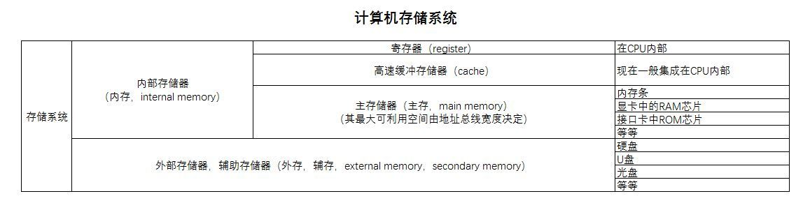
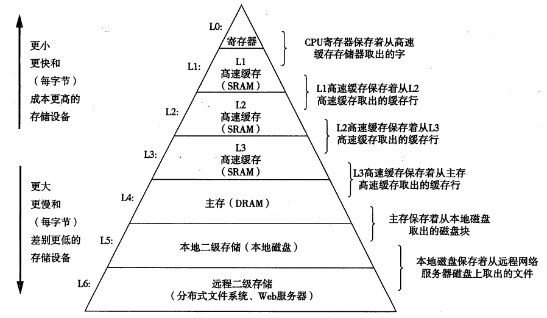

# 存储管理

内存资源是有限的，这里又涉及到『内存虚拟化』的概念。

**分层存储体系**：一般可以分为寄存器（register），高速缓存（cache）、主存、磁盘缓存、磁盘、可移动存储介质等。或者更简单一点：cache→主存→外部存储（包含 磁盘，SSD，U 盘，光盘等外部存储器件）。操作系统的工作是**将这个存储体系抽象（虚拟化）为一个有用的模型并管理这个抽象模型**。

> 严格意义上，主存和内存的关系，目前接受度较高的名词解释和关系如下图。 [电脑的主存储器和主存、内存的关系是什么？ - 乔乔-缩头者的回答 - 知乎](https://www.zhihu.com/question/28445273/answer/143956523)



> 从计算机体系结构的视角来看，存储结构如下图所示。



其中，寄存器、高速缓存、内存、磁盘缓存等属于操作系统『存储管理』的管理范畴，断电后信息不再存在。固定磁盘和可移动存储介质属于『设备管理』的管理范畴，它们存储的信息将被长期保存。:exclamation:  更准确点来说，其中寄存器、cache 等最底层的管理由硬件负责，并不由操作系统负责。

**存储管理器**：操作系统中负责管理『分层存储器体系』的部分。其任务有，如记录哪些内存正在使用，哪些内存是空闲的；进程需要时为其分配内存，进程使用完后释放内存。

## 内存的管理

内存的管理方案也是经过了以此改进。

### 无存储器抽象

无抽象，即没有任何对存储器模型的抽象（虚拟化），具体表现为，每一个程序都直接访问物理内存。如
```asm
MOV REGISTER1,1000      -- 将位置为 1000 的物理内存的内容移到 REGISTER1 中
```
直接访问物理内存，没有进行任何抽象，就是将物理内存划分的地址：从 0 到某个上限的物理地址空间。然后直接访问。

此时会出现第一个问题：内存中如何同时运行两个程序？比如第一个程序在 2000 位置写入一个新值，将会擦掉第二个程序放在相同位置的所有内容。

- 如果想要运行两个程序呢（当然同一时刻依然是运行一个程序，因为内存只能加载一个程序）？比如此时运行 A，想要运行 B。
    这个时候，就需要将新程序 B 从磁盘上加载到内存中，覆盖掉第一个程序 A。如果想再次运行 A，就要重新加载 A。

- 在没有内存抽象的系统中实现并行，一个简单的方法，即多线程并行。因为线程是共享进程资源的。但是这个方法显然没有从根本上解决上面的问题的。

### 一种存储器抽象：地址空间

从现代角度来看，物理地址暴露给进程容易引发各类严重问题，如
- 用户程序，可以很容易（故意或偶然）地破坏操作系统
- 直接使用物理地址，想要同时（如果单 CPU 就轮流运行）运行多个程序是很困难的（**理论上来说**，只要两个程序访问的物理地址完全没有冲突也是可以的，实际上是非常困难的）。

**地址空间**就是对内存的一种抽象。即内存的虚拟化，类似于进程概念中的 CPU 虚拟化。『地址空间』是一个进程可用于寻址内存的一套地址集合。每个进程都有一个自己的地址空间，各个进程的地址空间是独立的（当然，进程也可以共享地址空间）。


有了地址空间（虚拟/抽象的空间），就需要虚拟的地址空间到物理地址的映射/转换。

#### 基址寄存器和界限寄存器

最简单的就是**动态重定位**，即将每个进程的地址空间映射到物理内存的不同部分。实现『动态重定位』的最经典方法就是给每个 CPU 配置两个特殊的硬件寄存器，即**基址寄存器**和**界限寄存器**。当一个进程运行时，程序的起始物理地址加载到基址寄存器中，程序的长度加载到界限寄存器中。比如第一个进程的起始地址（虚拟地址）起始为 0，程序长度为 16384（即末尾地址-起始地址）。当第二个程序，虚拟地址空间的起始地址为 0，长度为 16384，则该程序运行时，基址寄存器的值为 16384，界限寄存器的值为 16384+16384=32768。如果再来一个相同长度的程序，基址寄存器和界限寄存器的值分别为 32768 和 16384.