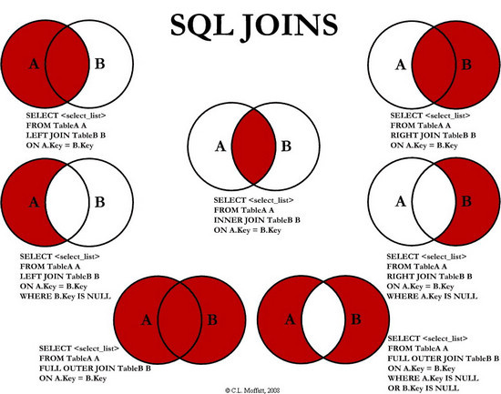

<a id="markdown-1-联结表" name="1-联结表"></a>

# 1. 联结表

<!-- TOC -->

* [1. 联结表](#1-联结表)
    - [1.1. 什么是联结？](#11-什么是联结)
        - [1.1.1. 为什么使用联结？](#111-为什么使用联结)
        - [1.1.2. 创建联结](#112-创建联结)
        - [1.1.3. 自联结 self join](#113-自联结-self-join)
        - [1.1.4. 内部联结 inner join](#114-内部联结-inner-join)
        - [1.1.5. 自然连接 natural join](#115-自然连接-natural-join)
        - [1.1.6. join 多个表](#116-join-多个表)
* [2. 高级 join](#2-高级-join)
    - [2.1. 使用表别名](#21-使用表别名)
    - [2.2. 外部联结 outer join](#22-外部联结-outer-join)
        - [2.2.1. left outer join 和 right outer join](#221-left-outer-join-和-right-outer-join)
        - [2.2.2. full outer join](#222-full-outer-join)
    - [2.3. 使用带聚集函数的 join](#23-使用带聚集函数的-join)
* [3. 各类 join 的示意图](#3-各类-join-的示意图)

<!-- /TOC -->

<a id="markdown-11-什么是联结" name="11-什么是联结"></a>

## 1.1. 什么是联结？

联结（join）是利用 SQL 中的 `select` 语句的一个重要操作。关系数据库中的表中包含各类**关系**，各个表之间通过**外键**相互关联。这些『外键』就是关系（表）之间相互 join 的基础（当然，两个没有外键关联的表也可以关联，只是没有实际意义罢了）。

每个表都有一个**主键**，该主键可以被其他表用来作外键。

> 外键：外键是某个表中的某些字段，包含其他表中的主键，定义了表之间的关系。具体见 [关系数据库.md](./数据库原理/关系数据库.md)

这样，可以看出关系数据库的优点：

* 可伸缩性好：能适应不断增加的工作量。

<a id="markdown-111-为什么使用联结" name="111-为什么使用联结"></a>

### 1.1.1. 为什么使用联结？

将数据分散成多个表有方便之处，如可伸缩性好。但是也有些许不好之处。数据存储在多个表中，检索的语句要稍微麻烦一点。使用联结机制，在一条 `select` 语句中关联表。联结在『运行时』关联表中的正确的行。

> 维护引用完整性： 使用关系表时，比如 `products` 表中插入非法的供应商 ID（即没有在 `vendors` 表中出现的 ID）的供应商产品，则这些产品是不可访问的，因为它们没有关联到某个供应商。为了防止这种情况发生，可指示 MySQL 只允许在 `products` 表中供应商 ID 字段出现合法值（即 `vendors` 中含有的 ID）。这就是维护引用完整性。这通过在表中定义中指定主键和外键来实现。

<a id="markdown-112-创建联结" name="112-创建联结"></a>

### 1.1.2. 创建联结

``` sql
select vend_name,prod_name,prod_price from vendors,products -- 后面看到这就是 联结
where vendors.vend_id=products.vend_id
order by vend_name,prod_name;   -- 优先以vend_name排序，vend_name相同以prod_name排序
```

`select` 语句查询的不是一个表中的字段， `from` 子句跟着两个表， `where` 子句指示 MySQL 匹配两个表中的 `vend_id` 。该 SQL 语句先建立联结，然后返回这两个表中对应的字段。（可以理解为将两个表合为一个虚拟的表，这个表按照 `vend_id` 一一对应起来）

在 `select` 语句联结几个表时，相应的关系是在运行时构造的。数据库表的定义中不存在能指示 MySQL 如何对表进行联结的东西。在两个联结时，第一个表中的每一行都会与第二个表中的每一行配对。 `where` 子句是过滤条件，它只包含给定条件的行。如果没有 `where` 的过滤条件，第一个表中的每一个行都会与第二个表中的每一个行进行配对，而不管它们逻辑上是否可以在一起。如，

``` sql
select vend_name,prod_name,prod_price from vendors,products
order by vend_name,prod_name; 
```

没有联结条件（ `where` 的过滤条件）返回的结果为**笛卡儿积**的结果。检索的数目将是第一个表中的行数乘以第二个表中的行数。

介绍各类 `join` 前，先介绍一下『笛卡尔积』的结果。现在有两个表：

SQL Schema:
~~~sql
create table if not exists table1(

    id int not null primary key,
    name varchar(255) 

 ); 
 create table if not exists table2(

    id int not null primary key,
    addr varchar(255),
    email varchar(30)

 ); 

insert into table1 values(1, 'Jack'), (2, 'Tony'), (3, 'Pony'); 
insert into table2 values(1, 'LA', '123@QQ. COM'), (2, 'NY', '345@QQ. COM'); 
~~~

| id | name |
|:--:|:----:|
|  1 | jack |
|  2 | tony |
|  3 | pony |

| addr |    email   |
|:----:|:----------:|
|  LA  | 123@qq.com |
|  NY  | 345@qq.com |

使用 `select * from table1,table2` 产生『笛卡尔积』结果：

| id | name | addr |    email   |
|:--:|:----:|:----:|:----------:|
|  1 | Jack |  LA  | 123@QQ. COM |
|  1 | Jack |  NY  | 345@QQ. COM |
|  2 | Tony |  LA  | 123@QQ. COM |
|  2 | Tony |  NY  | 345@QQ. COM |
|  3 | Pony |  LA  | 123@QQ. COM |
|  3 | Pony |  NY  | 345@QQ. COM |

以下介绍的各类 `join` ， `inner join` ， `outer join` ， `left outer join` ， `right outer join` 等都是从『笛卡儿积』中选取满足 `join` 条件的记录（行）。

> `inner join` 的 inner 可以省略， `left outer join` 可以省略 `outer` 。

<a id="markdown-113-自联结-self-join" name="113-自联结-self-join"></a>

### 1.1.3. 自联结 self join

SQL Schema 如下:

``` sql
create table if not exists customer(
    id int not null auto_increment primary key,
    company varchar(255) null,
    name varchar(20)
) engine=innodb;

insert into customer(company,name) values('Fun4All','Tom');
insert into customer(company,name) values('Baidu','Jerry');
insert into customer(company,name) values('Google','Herry');
insert into customer(company,name) values('Tencent','MahuaTeng');
insert into customer(company,name) values('Fun4All','Bill');
```

该模式下，创建的关系（表）如下，

| id | company |    name   |
|:--:|:-------:|:---------:|
|  1 | Fun4All |    Tom    |
|  2 |  Baidu  |   Jerry   |
|  3 |  Google |   Herry   |
|  4 | Tencent | MahuaTeng |
|  5 | Fun4All |    Bill   |

**self join** 就是表自己和自己 join，一般用来代替如下的子查询：
~~~sql
select * from customer 
where company in (select company from customer where name ='Tom'); 
~~~

相应的 `self join` 如下，

``` sql
select * from customer c1, customer c2
where c1.company=c2.company and c1.name='Tom';
```

得到如下检索结果：

| id | company | name | id | company | name |
|:--:|:-------:|:----:|:--:|:-------:|:----:|
|  1 | Fun4All |  Tom |  1 | Fun4All |  Tom |
|  1 | Fun4All |  Tom |  5 | Fun4All | Bill |

<a id="markdown-114-内部联结-inner-join" name="114-内部联结-inner-join"></a>

### 1.1.4. 内部联结 inner join

内部 `join` 又称为『等值』 `join` 。用 `inner join` 指定表的 `join` 关系， `on` 指明联结条件。如果不加联结条件，检索结果为笛卡尔积结果。加上 `on` 的 `join` 条件，但是会有重复行。如下：

``` sql
select * from table1,table2 where table1.id=table2.id; -- 不推荐的写法，效率低
```

检索结果如下：

| id | name | id | addr |    email   |
|:--:|:----:|:--:|:----:|:----------:|
|  1 | Jack |  1 |  LA  | 123@QQ. COM |
|  2 | Tony |  2 |  NY  | 345@QQ. COM |

以上的两个表中的相等测试 `where table1.cust_id=table2.cust_id` ，这种也是『内部联结』。更高效率的写法为
~~~sql
select * from table1 inner join table2 -- inner 可以省略
on table1.id=table2.id; -- 也可以是 where 子句
~~~

<a id="markdown-115-自然连接-natural-join" name="115-自然连接-natural-join"></a>

### 1.1.5. 自然连接 natural join

无论何时对表进行 join，应该至少有一个列出现在不止一个表中（被联结的列）。标准的 join 返回所有数据，相同的列多次出现。**自然联结**可以使得每个列返回一次。

使用 `select * from customer as a natural join customer as b;` 检索结果如下：

| id | company |    name   |
|:--:|:-------:|:---------:|
|  1 | Fun4All |    Tom    |
|  2 |  Baidu  |   Jerry   |
|  3 |  Google |   Herry   |
|  4 | Tencent | MahuaTeng |
|  5 | Fun4All |    Bill   |

使用 `select * from table1 natural join table2;` 则检索结果如下：

| id | name | addr |    email   |
|:--:|:----:|:----:|:----------:|
|  1 | Jack |  LA  | 123@QQ. COM |
|  2 | Tony |  NY  | 345@QQ. COM |

可以看出， `table1` 中的第三行并没有没 join。两个表如果没有相同记录的字段，则检索结果为空。例如， `table2` 中的 `id` 分别为 `4，5` 时， `natural join` 的结果为空。同时可以看出了 `natural join` 和 `inner join` 其实非常类似，都是基于『等值测试』。区别就是 `inner join` 的等值测试需要显示指出，并且 `natual join` 自动重叠相同的列。

自然 join 基于等值，如果 R 和 S 具有相同的属性组 Y，则自然 join 可以记为，

``` 
R*S={tr∩ts|tr∈R ^ ts∈S ^ tr[Y]=ts[Y]}
```

***数据库通过自己的判断*** 并使用表内所有的相同字段作为 join 的联结条件完成联结过程，不需要指定联结条件。一般的写法是第一个表用 `*` 指定字段，其他的表用明确的表字段指定。如下，

``` sql
select c.*,o.order_num,o.order_date,oi.prod_id,oi.quantity,oi.item_price
from customer as c,orders as o, orderitems as oi
where c.cust_id=o.cust_id
and oi.order_num=o.order_num
and prod_id='FB';
```

> :exclamation: 最好不要让数据库自动完成联结。natural join 关键字在 MySQL 中不再适用。自然 join 的工作完全交给了 user。事实上，几乎用到的都是自然 join。因此，MySQL 中希望将 natural join 的工作交给用户完成。:exclamation: 我们迄今为止建立的每个内联结都是自然联结，很可能永远都不会用到不是自然联结的内联结。因此，无需使用自然 join

<a id="markdown-116-join-多个表" name="116-join-多个表"></a>

### 1.1.6. join 多个表

语法如下，

``` sql
select prod_name,vend_name,prod_price,quantity
from orderitems,products,vendors    -- join 三个表 （自然联结/内联结 三个表）
where products.vend_id=vendors.vend_id and orderitems.prod_id=products.prod_id and order_num=20005;
```

> join 对性能影响较大。

join 表可以代替嵌套 `select` 子句。如，

``` sql
select cust_name,cust_contact from customers
where cust_id in (select cust_id from orders 
                    where order_nums in (
                        select order_num from orderitems
                        where prod_id ='TNT2'
                    )
                );
-- 替换为
select cust_name,cust_contact 
from customers,orders,orderitems
where customers.cust_id=orders.cust_id
and orderitems.order_num=orders.order_num
and prod_id='TNT2'; 

-- 显示 join
select cust_name,cust_contact 
from  customers 
      inner join orders on customers.cust_id=orders.cust_id
      inner join orderitems on orderitems.order_num=orders.order_num and prod_id='TNT2'; 
```

join 表的用法，join 三个表，然后通过 `where` 的三个过滤条件，返回检索结果。

<a id="markdown-2-高级-join" name="2-高级-join"></a>

# 2. 高级 join

<a id="markdown-21-使用表别名" name="21-使用表别名"></a>

## 2.1. 使用表别名

sql可以给字段和计算字段起别名（导出字段）。同样可以给表起别名。

``` sql
select cust_name,cust_contact 
from customers as c,orders as o,orderitems as oi
where c.cust_id=o.cust_id
and oi.order_num=o.order_num
and prod_id='TNT2'; 
```

<a id="markdown-22-外部联结-outer-join" name="22-外部联结-outer-join"></a>

## 2.2. 外部联结 outer join

`outer join` 将 `inner join` 的没有关联的记录也会显示出来。 `outer join` 可以保留未匹配关联的记录（行），使用 `select * from table1 left outer join table2 on table1.id=table2.id` 返回（可以和上面的 `inner join` 的结果对比一下）：

| id | name |   id   |  addr  |    email   |
|:--:|:----:|:------:|:------:|:----------:|
|  1 | Jack |    1   |   LA   | 123@QQ. COM |
|  2 | Tony |    2   |   NY   | 345@QQ. COM |
|  3 | Pony | (null) | (null) |   (null)   |

<a id="markdown-221-left-outer-join-和-right-outer-join" name="221-left-outer-join-和-right-outer-join"></a>

### 2.2.1. left outer join 和 right outer join

为了理解 `left outer join` 和 `right outer join` 的区别，看一下使用 `select * from table1 right outer join table2 on table1.id=table2.id` 返回：

| id | name | id | addr |    email   |
|:--:|:----:|:--:|:----:|:----------:|
|  1 | Jack |  1 |  LA  | 123@QQ. COM |
|  2 | Tony |  2 |  NY  | 345@QQ. COM |

可以看出 `left,right outer join` 的区别在于**以左侧表为基准还是右侧**。例如 `table1 right outer join  table2 on table1.id=table2.id` ，将会以 `table2` 为基准，如果 `table1` 中没有记录和 `table2` 中的记录（行）匹配，则以 NULL 值返回。

区别具体如下：

1. `left outer join` 以『左表』为基准，左表的行一定会列出，右表如果没有匹配的行，就为 NULL。如果右表有多行和左表匹配，那么左表相同的行会出现多次。

2. `right outer join` 与 1 相反

> `left,right outer join` 不可以忽略 `on` 联结条件。

<a id="markdown-222-full-outer-join" name="222-full-outer-join"></a>

### 2.2.2. full outer join

`full outer join` 或 `full join` ，是左右 join 的结合版本。

> MySQL 未实现 `full outer join` ，但是很容易通过 `union` 来实现，见 [union.md](union.md)

``` sql
select *from table1 left outer join table2 on table1.id=table2.id 
union
select *from table2 right outer join table1 on table1.id=table2.id;
```

检索结果如下：

|   id   |  name  |     id     |  addr  |    email   |
|:------:|:------:|:----------:|:------:|:----------:|
|    1   |  Jack  |      1     |   LA   | 123@QQ. COM |
|    2   |  Tony  |      2     |   NY   | 345@QQ. COM |
|    3   |  Pony  |   (null)   | (null) |   (null)   |
|    1   |   LA   | 123@QQ. COM |    1   |    Jack    |
|    2   |   NY   | 345@QQ. COM |    2   |    Tony    |
| (null) | (null) |   (null)   |    3   |    Pony    |

---

<a id="markdown-23-使用带聚集函数的-join" name="23-使用带聚集函数的-join"></a>

## 2.3. 使用带聚集函数的 join

aggregate function 用来汇总数据，当然可以汇总多个表的数据。即联合 join 一起使用即可。

``` sql
select customers.cust_name,customers.cust_id,count(orders.order_num) as num_ord
from customers inner join orders
on customers.cust_id =orders.cust_id
group by customers.cust_id;
```

该语句首先使用 `inner join` 将两个表关联，接着 `group by` 进行分组，随后 `count` 对每个组进行计数。

<a id="markdown-3-各类-join-的示意图" name="3-各类-join-的示意图"></a>

# 3. 各类 join 的示意图


