# 关系数据库的基本概念


数据模型有以下几种：
* 层次模式：格式化数据模型，效率不低于网状模型【树】
* 网状模型：格式化数据模型，效率高于关系模型【图】
* 关系模型：应用最广的数据模型，查询效率不如格式化数据模型【表】，需通过 SQL 优化来提升效率
* 面向对象数据模型：基于面向对象思想发展的模型
* 对象关系数据模型
* 半结构化数据模型和非结构数据模型：如 XML, JSON, HTML 等半结构化和非结构化的模型，将结构和数据独立起来。

**关系数据库** 是指采用 **关系模型** 的数据库。

## 相关术语

一些关系数据库的概念可以在 [概述](概述.md) 之中找到。

* 域 domain：一组具有相同数据类型的值的集合，类似于定义域。
* 笛卡尔积：见下
* **关系：关系是笛卡尔积的子集，就是一张二维的表**。
  - 由于笛卡尔积按照数学定义是**不满足交换律**的，即 $(d_1,d_2) \neq (d_2,d_1)$ 。故而关系作为关系数据模型的数据结构时，应当添加限定和扩充。
    - 不存在无限关系
    - 为关系的每个列（属性）添加一个属性名来取消关系属性的有序性，即 $(d_1,d_2,\ldots,d_i,d_j,\ldots,d_n) = (d_1,d_2,\ldots,d_j,d_i,\ldots,d_n)$ 
* **超码**：能唯一的标识一个记录
* 候选码：能唯一标识一行（一个记录、一个元组）的属性组，**而其子集不能**。
  * **候选码是超码的极小集**。
* 主码：从候选码中任取一个作为主码
* **主属性**：**候选码的属性（不只是主码的）称之为主属性**
* 非主属性、非码属性：非候选码的属性

## 关系的三种类型（三种类型的表）

1. 基本表（基本关系）：实际存在的表，是实际存储数据的逻辑表示
2. 查询表：查询结果对应的表
3. 视图：由基本表或其他视图导出的表，是一个 **虚表**

## 笛卡尔积

笛卡尔积，又称直积，概念非常简单，对于 集合 A 和 B，其笛卡尔积 $A\times B$ 可表示为，
$$
A\times B = \{(x,y)~|~x\in A, y \in B\}
$$
例如，对于 $A=\{a,b\}$，$B=\{0,1,2\}$，则
$$
A×B=\{(a, 0), (a, 1), (a, 2), (b, 0), (b, 1), (b, 2)\}\\
B×A=\{(0, a), (0, b), (1, a), (1, b), (2, a), (2, b)\}
$$

## 关系模式

**关系** 是 **元组**（tuple，或记录 record） 的集合，而元组是值的列表。展示一个关系的方法就是将它的元组作为一个个的行列出来。列的头称为 **属性**，表示每一个分量的含义。关系名、属性名、以及属性类型称作 **该关系** 的模式。

如"数据库系统实现"给出的例子，

|     title     | year  | length |
| :-----------: | :---: | :----: |
|   star wars   | 1977  |  124   |
| mighty ducks  | 1991  |  104   |
| wayne's world | 1992  |   95   |


**该关系的模式**（不是数据库模式）的形式化定义为：
```
R(U,D,DOM,F)
```
其中 `R` 为关系名，`U` 为 属性名的集合，`D` 为各属性域的集合，`DOM` 为属性向域的映像的集合，`F` 为了数据之间的依赖关系。 

对于上面的例子中，显然有 `R = Movie`，`U = {title, year, length}`，`D = {dom(title) = vchar, dom(year) = int, dom(length) = int}`，`F = { title --> year, title --> age`。

其中 `DOM` 就是指明某个属性属于哪一个域（D）。

关系模式可以简记为，
```
Movie(title,year,length)
```
由此可以看出，关系模式和关系一般在称谓上不加以区分。

关系表中的行称为 **记录**，列称为 **字段** 或 **属性**。


> **关系数据库模式**，即关系数据库的『型』（type），是对关系数据库的描述，包括若干域的定义以及在这些域上定义的关系模式。

## ER 模型转换为关系模式

其实很简单。以下面的 ER 图为例。


该 ER 模型可以转换关系模型，过程如下，

1. 实体集 --> 关系模型，此时可成三个关系模式，即
```
职工（职工号，姓名，性别，年龄）        -- 职工号为 key
部门（部门号，部门名称，...）           -- 部门号为 key
职称职务（代号，名称，津贴）              -- 代号为 key
```

2. 将每个联系集转换为关系模式，这里遵守以下规则：
    属性转换遵守以下：
    - 单独的属性都转换为该关系的属性
    - R **涉及到的每个实体集的码属性转换为该关系的属性**
    **key 转换** 遵守以下：
    - 若联系 R 为 1：1 联系，则每个相关实体的码均可作为关系的候选码；
    - 若为 1：N，则关系的码为 N 端实体的码；
    - 若为 M：N，则关系的码为相关实体码的集合

因此，联系可以转换为以下关系模式：
```
分工（职工号，部门号）      -- 职工号为 key
任职（职工号，代号，任职日期） -- （职工号、代号）为 key
```

如果具有相同码的多个关系模式合并成一个关系模型。具有相同码的不同关系模型本质上是描述的同一实体集，因此可以合并。如职工关系和分工关系可以合并为
```
职工（职工号，姓名，性别，年龄，部门号）    -- 职工号为 key
```

## 关系的操作

增删改查等操作。查询操作可以分为：
- select from where
- project 投影
- join 连接
- divide 除
- union
- except
- intersection
- 笛卡尔积


## 关系的完整性约束

完整性约束，规定了数据模型中数据必须符合的条件。为了保护用户对数据库所做的修改不会破坏数据库的完整性。

1. 实体完整性
    - 任一候选码的任何属性都不能为 NULL，即『非空约束』

2. 参照完整性

## 关系代数

本节内容略过。