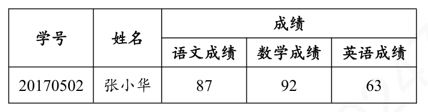

# 数据库范式

数据库的设计范式，是数据库设计所需要的满足的规范，满足这些规范的数据库是简洁的、结构明细的，同时不会发生 insert、delete、update 操作异常。即数据库为了设计的更加合理高效，应遵循一定的规范。

而教材中给的定义是：『符合某一种级别的关系模式的集合，表示一个关系内部各属性之间的联系的合理化程度』。简单理解为，一张数据表结构所符号的某种设计标准。

## 1NF 第一范式

符合 1NF 的关系「可以理解为数据表。“关系模式”和“关系”的区别，类似于面向对象程序设计中“类”与“对象”的区别。“关系”是“关系模式”的一个实例，你可以把“关系”理解为一张带数据的表，而“关系模式”是这张数据表的表结构」。

**1NF**：关系中的每个属性不可区分。如下关系（数据表），就不满足 1NF

1NF 是所有**关系数据库**最基本的要求。但是仅仅符合 1NF 的设计，仍然会存在数据冗余过大，插入异常，删除异常，修改异常等问题。如下

1. 每一个学生的学号、姓名、系名、系主任这些数据重复多次。每个系与对应的系主任的数据也重复多次---**数据冗余过大**

2. 假如学校新建一个系，但是暂时还没有招收任何学生（比如 3 月份就新建了，但是要等到 8 月份才招生），那么无法将系名和系主任的数据单独添加到数据表中的---**插入异常**
    - 根据三种关系完整性约束中实体完整性要求，关系中的 key 所包含的任意一个属性都不能为 NULL，所有属性的组合也不能重复。为了满足此要求，图中的表，只能将学号和课名的组合作为 key，否则无法唯一地区分每一条记录。
    - key：关系中某个或某几个属性的组合，可以唯一区分每个元组（记录/行）。

3. 假如将某个系中的所有学生相关的记录都删除，那么所有系与系主任的数据也随之消失了---**删除异常**

4. 加入小明转到其他系，那么为了保证数据库中的数据一致性，需要修改三条记录中系与系主任的数据---**修改异常**

由此可见，仅仅满足 1NF 的远不能满足要求。

## 2NF 第二范式

**2NF**在 1NF 的基础上，消除了非主属性对于 key 的部分函数依赖。即在 1NF 的基础上，而且它的所有非主属性都**完全依赖于**整个主关键字（不存在部分依赖），则该关系满足 2NF。

### 函数依赖

设 R(U) 是属性集 U 上的关系模式。X，Y 是 U 的子集。若对于 R(U) 的任意一个可能的关系 r 中不可能存在两个元组在 X 上的属性值相等，而在 Y 上的属性值不等，则

若在一张表中，在属性（或属性组）X 的值确定的情况下，必定能确定属性 Y 的值，那么就可以说 Y 函数依赖于 X，写作 **X-->Y**。也就是说，在数据表中，不存在任意的两条记录，它们在 X 属性（或属性组）上的值相同，而在 Y 属性上的值不同。这就是『函数依赖』名字的由来，类似于函数关系 y=f(x)，在 x 的值确定的情况下，y 的值一定是确定的。

例如，对于上表中的数据，找不到任何一条记录，它们的学号相同，而对应的姓名不同。所以我们可以说**姓名函数依赖于学号**，写作**学号-->姓名**。但是反过来，因为可能出现同名学生，所以有可能不同的两条学生记录，它们在姓名上的值相同，但对应的学号不同，所以我们不能说学号函数依赖于姓名。上表中，其他的函数依赖还有如：
- 系名-->系主任
- 学号-->系主任
- （学号，课名）-->分数
但以下函数依赖关系则不成立：
- 学号-->课名
- 学号-->分数
- 课名-->系主任
- （学号，课名）--> 姓名 :exclamation:后面看到这是个部分函数依赖
#### 完全函数依赖

若一张表中，若 X-->Y，且对于 X 的任何一个真子集（假设属性组 X 包含超过一个属性的话，即 X 的 size 大于 1），X'-->Y 不成立，那么我们称 Y 对于 X **完全函数依赖**，写作 X--F-->Y，如下面公式
$$X \stackrel{F}{\rightarrow} Y$$
例如：
- 学号--F-->姓名
- （学号，课名）--F-->分数

#### 部分函数依赖

假如 X-->Y，但同时 Y 并不完全函数依赖于 X，那么我们称 Y 部分函数依赖于 X，写作 X--P-->Y，如下
$$X \stackrel{P}{\rightarrow} Y$$
例如，
- （学号，课名）--P--> 姓名

## reference

1. [如何理解关系型数据库的常见设计范式？ - 刘慰的回答 - 知乎](https://www.zhihu.com/question/24696366/answer/29189700)
