# 数据库范式

数据库的设计范式，是数据库设计所需要的满足的规范，满足这些规范的数据库是简洁的、结构明细的，同时不会发生 insert、delete、update 操作异常。即数据库为了设计的更加合理高效，应遵循一定的规范。

而教材中给的定义是：『符合某一种级别的关系模式的集合，表示一个关系内部各属性之间的联系的合理化程度』。简单理解为，一张数据表结构所符号的某种设计标准。

写在最前面，总体而言：
* 1NF: 属性不可分
* 2NF: 消除非主属性对码的部分依赖（每个字段/列/属性 都和码相关，即与码相关）
* 3NF: 消除非主属性对码的传递函数依赖（非主属性之间不存在依赖，即属性间无关）
* BCNF: 3NF 的基础上消除 **主属性** 对码的部分和传递函数依赖（函数依赖是多值依赖的一种特殊情况）
* 4NF: 消除了 **非平凡且非函数依赖** 的多值依赖（多值依赖是连接依赖的一种特殊情况）
* 5NF: 消除了 **非平凡** 的连接依赖

> 关系模式的规范化过程就是通过对关系模式的分解来实现的，即把低一级的关系模式分解为若干个高一级的关系模式。

## 1NF 第一范式

符合 1NF 的关系「可以理解为数据表。“关系模式”和“关系”的区别，类似于面向对象程序设计中“类”与“对象”的区别。“关系”是“关系模式”的一个实例，你可以把“关系”理解为一张带数据的表，而“关系模式”是这张数据表的表结构」。

**1NF**：关系中的每个属性不可区分。如下关系（数据表），就不满足 1NF

```
// table 1
╔════════╦══════════╦══════════════════════════╗
║ stu_id ║ stu_name ║          scores          ║
╠════════╬══════════╬═════════╦══════╦═════════╣
║        ║          ║ Chinese ║ Math ║ English ║
╠════════╬══════════╬═════════╬══════╬═════════╣
║        ║          ║         ║      ║         ║
╚════════╩══════════╩═════════╩══════╩═════════╝
```

1NF 是所有**关系数据库**最基本的要求。因此上表因转换为下面表。

```
// table 2
╔════════╦══════════╦═════════════════╦═════════════╦════════════════╗
║ stu_id ║ stu_name ║ Chineses scores ║ Math socres ║ English scores ║
╠════════╬══════════╬═════════════════╬═════════════╬════════════════╣
║        ║          ║                 ║             ║                ║
╚════════╩══════════╩═════════════════╩═════════════╩════════════════╝
```

但是仅仅符合 1NF 的设计，仍然会存在数据冗余过大，插入异常，删除异常，修改异常等问题。如下

```
// table 3
╔════════╦══════════════╦════════════╦════════════╦══════════════════╦════════╗
║ stu_id ║   stu_name   ║ department ║    dean    ║      course      ║ scores ║
╠════════╬══════════════╬════════════╬════════════╬══════════════════╬════════╣
║   01   ║  Li Xiaoming ║  economics ║ Wang Qiang ║    Mathematics   ║   95   ║
╠════════╬══════════════╬════════════╬════════════╬══════════════════╬════════╣
║   01   ║  Li Xiaoming ║  economics ║ Wang Qiang ║      English     ║   87   ║
╠════════╬══════════════╬════════════╬════════════╬══════════════════╬════════╣
║   01   ║  Li Xiaoming ║  economics ║ Wang Qiang ║     Chemistry    ║   76   ║
╠════════╬══════════════╬════════════╬════════════╬══════════════════╬════════╣
║   02   ║  Zhang Lili  ║  economics ║ Wang Qiang ║    Mathematics   ║   72   ║
╠════════╬══════════════╬════════════╬════════════╬══════════════════╬════════╣
║   02   ║  Zhang Lili  ║  economics ║ Wang Qiang ║      English     ║   86   ║
╠════════╬══════════════╬════════════╬════════════╬══════════════════╬════════╣
║   02   ║  Zhang Lili  ║  economics ║ Wang Qiang ║ Computer Science ║   90   ║
╠════════╬══════════════╬════════════╬════════════╬══════════════════╬════════╣
║   03   ║ Gao Fangfang ║     law    ║  Liu Ling  ║ Computer Science ║   68   ║
╠════════╬══════════════╬════════════╬════════════╬══════════════════╬════════╣
║   03   ║ Gao Fangfang ║     law    ║  Liu Ling  ║    Mathematics   ║   92   ║
╠════════╬══════════════╬════════════╬════════════╬══════════════════╬════════╣
║   03   ║ Gao Fangfang ║     law    ║  Liu Ling  ║        Law       ║   98   ║
╚════════╩══════════════╩════════════╩════════════╩══════════════════╩════════╝
```

1. 每一个学生的学号、姓名、系名、系主任这些数据重复多次。每个系与对应的系主任的数据也重复多次——**数据冗余过大**
2. 假如学校新建一个系，但是暂时还没有招收任何学生（比如 3 月份就新建了，但是要等到 8 月份才招生），那么无法将系名和系主任的数据单独添加到数据表中的——**插入异常**
    - 根据三种关系完整性约束中实体完整性要求，关系中的 key 所包含的任意一个属性都不能为 NULL，所有属性的组合也不能重复。为了满足此要求，图中的表，只能将学号和课名的组合作为 key，否则无法唯一地区分每一条记录。
    - key：关系中某个或某几个属性的组合，可以唯一区分每个元组（记录/行）。
3. 假如将某个系中的所有学生相关的记录都删除，那么所有系与系主任的数据也随之消失了——**删除异常**
4. 加入小明转到其他系，那么为了保证数据库中的数据一致性，需要修改三条记录中系与系主任的数据——**修改异常**或**更新异常**

由此可见，仅仅满足 1NF 的远不能满足要求。

## 2NF 第二范式

**2NF** 在 1NF 的基础上，消除了非主属性对于 key 的部分函数依赖。即在 1NF 的基础上，而且它的所有非主属性都 **完全依赖于** 整个主关键字（不存在部分依赖），则该关系满足 2NF。

### 函数依赖

设 R(U) 是属性集 U 上的关系模式。X，Y 是 U 的子集。若对于 R(U) 的任意一个可能的关系 r 中不可能存在两个元组在 X 上的属性值相等，而在 Y 上的属性值不等，则

若在一张表中，在属性（或属性组）X 的值确定的情况下，必定能确定属性 Y 的值，那么就可以说 Y 函数依赖于 X，写作 **X→Y**。也就是说，在数据表中，不存在任意的两条记录，它们在 X 属性（或属性组）上的值相同，而在 Y 属性上的值不同。这就是『函数依赖』名字的由来，类似于函数关系 y=f(x)，在 x 的值确定的情况下，y 的值一定是确定的。

例如，对于 `table 4` 中的数据，找不到任何一条记录，它们的学号相同，而对应的姓名不同。所以我们可以说 **姓名函数依赖于学号**，写作 **学号→姓名**。但是反过来，因为可能出现同名学生，所以有可能不同的两条学生记录，它们在姓名上的值相同，但对应的学号不同，所以我们不能说学号函数依赖于姓名。上表中，其他的函数依赖还有如：

- 系名→系主任
- 学号→系主任
- （学号，课名）→分数

但以下函数依赖关系则不成立：

- 学号→课名
- 学号→分数
- 课名→系主任

#### 完全函数依赖

若一张表中，若 X→Y，且对于 X 的任何一个真子集（假设属性组 X 包含超过一个属性的话，即 X 的 size 大于 1），X'→Y 不成立，那么我们称 Y 对于 X **完全函数依赖**，写作

$$X \stackrel{F}{\rightarrow} Y$$

例如：
- 学号 $\stackrel{F}{\rightarrow}$ 姓名
- （学号，课名）$\stackrel{F}{\rightarrow}$ 分数

#### 部分函数依赖

假如 X→Y，但同时 Y 并不完全函数依赖于 X，那么我们称 Y 部分函数依赖于 X，写作

$$X \stackrel{P}{\rightarrow} Y$$

例如，
- （学号，课名）$\stackrel{P}{\rightarrow}$ 姓名

#### 传递函数依赖

假如 Z 函数依赖于 Y，且 Y 函数依赖于 X『且 Y 不包含于 X，且 X 不函数依赖于 Y』，那么我们称 Z 传递函数依赖于 X，记作

$$X \stackrel{T}{\rightarrow} Y$$

#### 码 key

[概述](概述.md) 和 [关系数据库](关系数据库.md) 中已经介绍过『码』key 的概念，这里根据函数依赖再次介绍下，即设 K 为某个关系（表）的一个属性或属性组，若除 K 之外的所有属性**完全函数依赖于** K，那么我们称 K 为『候选码』，简称码 key。这里的完全函数依赖即 [概述](概述.md) 中所说的 K 中没有多余的属性。一张表可以多个 key，通常选择其中一个作为『主码』primary key。

#### 判断是否满足 2NF

判断一个关系符合 2NF，即判断关系中是否**存在非主属性对于码的部分函数依赖**。方法如下，
1. 找出数据表中的所有『码』
2. 找出所有的『主属性』
3. 查看剩下是否存在非主属性对码的『部分函数依赖』

以之前那个表为例，其函数依赖关系如下：



对于（学号，课名） → 姓名，有 学号 → 姓名，存在非主属性 姓名 对码（学号，课名）的部分函数依赖。对于（学号，课名） → 系名，有 学号 → 系名，存在非主属性 系名 对码（学号，课名）的部分函数依赖。对于（学号，课名） → 系主任，有 学号 → 系主任，存在非主属性  对码（学号，课名）的部分函数依赖。

所以 `table 4` 不符合 2NF 的要求，只满足 1NF 的要求。

#### 如何消除部分函数依赖？

为了让关系符合 2NF 的要求，我们只能将关系进行拆分成更小的表。在拆分的过程中，要达到更高一级范式的要求，这个过程叫做『模式分解』。模式分解的方法不是唯一的，以下是其中一种：

选课（学号，课名，分数）
学生（学号，姓名，系名，系主任）

下图是模式分解后的新的函数依赖关系：


分解后的表：
```
// table 4
╔════════╦══════════════╦════════════╦════════════╗
║ stu_id ║   stu_name   ║ department ║    dean    ║
╠════════╬══════════════╬════════════╬════════════╣
║   01   ║  Li Xiaoming ║  economics ║ Wang Qiang ║
╠════════╬══════════════╬════════════╬════════════╣
║   02   ║  Zhang Lili  ║  economics ║ Wang Qiang ║
╠════════╬══════════════╬════════════╬════════════╣
║   03   ║ Gao Fangfang ║     law    ║  Liu Ling  ║
╚════════╩══════════════╩════════════╩════════════╝

╔═════════╦═════════════╦════════╗
║ stu_id  ║    course   ║ scores ║
╠═════════╬═════════════╬════════╣
║    01   ║ Mathematics ║   95   ║
╠═════════╬═════════════╬════════╣
║    01   ║     ...     ║   ...  ║
╠═════════╬═════════════╬════════╣
║    02   ║ Mathematics ║   72   ║
╠═════════╬═════════════╬════════╣
║    02   ║     ...     ║   ...  ║
╠═════════╬═════════════╬════════╣
║    03   ║ Mathematics ║   88   ║
╚═════════╩═════════════╩════════╝

```

现在我们来看一下，进行同样的操作，是否还存在着之前的那些问题？

1. 李小明转系到法律系
    只需要修改一次李小明对应的系的值即可。——有改进
2. 数据冗余是否减少了？
    学生的姓名、系名与系主任，不再像之前一样重复那么多次了。——有改进
3. 删除某个系中所有的学生记录
    该系的信息仍然全部丢失。——无改进
4. 插入一个尚无学生的新系的信息。
    因为学生表的码是学号，不能为空，所以此操作不被允许。——无改进

所以说，仅仅符合 2NF 的要求，很多情况下还是不够的，而出现问题的原因，在于仍然存在非主属性系主任对于码学号的传递函数依赖。为了能进一步解决这些问题，我们还需要将符合 2NF 要求的数据表改进为符合 3NF 的要求。

## 3NF 第三范式

**3NF** 是在 2NF 的基础上，消除了非主属性对于 key 的传递函数依赖。也就是说，如果存在非主属性对于码的传递函数依赖，则不符合 3NF 的要求。

对于选课表，主码为（学号，课名），主属性为『学号』和『课名』，非主属性只有一个，即『分数』。不可能存在传递函数依赖，故符合 3NF。

对于学生表，主码为『学号』，主属性为『姓名、系名、系主任』。由于 学号→系名，同时 系名→系主任，故而 系主任对码『学号』存在传递函数依赖。故不符合 3NF 的要求。

为了达到 3NF 的要求，我们进一步进行模式分解为以下形式：
选课（学号，课名，分数）
学生（学号，姓名，系名）
系（系名，系主任）

新的函数依赖关系如下


分解后的新关系如下，
```
// table 5
╔═════════╦═════════════╦════════╗
║ stu_id  ║    course   ║ scores ║
╠═════════╬═════════════╬════════╣
║    01   ║ Mathematics ║   95   ║
╠═════════╬═════════════╬════════╣
║    01   ║     ...     ║   ...  ║
╠═════════╬═════════════╬════════╣
║    02   ║ Mathematics ║   72   ║
╠═════════╬═════════════╬════════╣
║    02   ║     ...     ║   ...  ║
╠═════════╬═════════════╬════════╣
║    03   ║ Mathematics ║   88   ║
╚═════════╩═════════════╩════════╝

╔════════╦══════════════╦════════════╗
║ stu_id ║   stu_name   ║ department ║
╠════════╬══════════════╬════════════╣
║   01   ║ Li Xiaoming  ║  economics ║
╠════════╬══════════════╬════════════╣
║   02   ║  Zhang Lili  ║  economics ║
╠════════╬══════════════╬════════════╣
║   03   ║ Gao Fangfang ║     law    ║
╚════════╩══════════════╩════════════╝

╔═════════════╦════════════╗
║ department  ║    dean    ║
╠═════════════╬════════════╣
║  economics  ║ Wang Qiang ║
╠═════════════╬════════════╣
║     law     ║  Liu Ling  ║
╚═════════════╩════════════╝

```

现在我们来看一下，进行同样的操作，是否还存在着之前的那些问题？

1. 删除某个系中所有的学生记录
    该系的信息不会丢失 —— 有改进
2. 插入一个尚无学生的新系的信息。
    因为系表与学生表目前是独立的两张表，所以不影响 —— 有改进
3. 数据冗余更加少了 —— 有改进

**结论**
由此可见，符合 3NF 要求的数据库设计，**基本上**解决了数据冗余过大，插入异常，修改异常，删除异常的问题。当然，在实际中，往往为了性能上或者应对扩展的需要，经常 做到 2NF 或者 1NF，但是作为数据库设计人员，至少应该知道，3NF 的要求是怎样的。


## BCNF 范式

BCNF（Boyce Codd Normal Form）是由 Boyce 和 Codd 提出的，比 3NF 又进了一步。通常认为是修正的第三范式，有时也称为扩充的第三范式。

为什么说 3NF 需要修正？看下面这个问题：
若：
1. 某公司有若干个仓库；
2. 每个仓库只能有一名管理员，一名管理员只能在一个仓库中工作；
3. 一个仓库中可以存放多种物品，一种物品也可以存放在不同的仓库中。每种物品在每个仓库中都有对应的数量。

那么关系模式 仓库（仓库名，管理员，物品名，数量） 属于哪一级范式？

答：
已知函数依赖集：仓库名 → 管理员，管理员 → 仓库名，（仓库名，物品名）→ 数量
码：（管理员，物品名），（仓库名，物品名）
主属性：仓库名、管理员、物品名
非主属性：数量
∵ 不存在非主属性对码的部分函数依赖和传递函数依赖。
∴ 此关系模式属于 3NF。

基于此关系模式的关系（具体的数据可能如下）：
```
╔═══════════╦═══════════╦═══════════╦══════════╗
║ warehouse ║  manager  ║    item   ║ quantity ║
╠═══════════╬═══════════╬═══════════╬══════════╣
║  Shanghai ║ Zhang San ║ iphone 5s ║    20    ║
╠═══════════╬═══════════╬═══════════╬══════════╣
║  Shanghai ║ Zhang San ║  ipad Air ║    49    ║
╠═══════════╬═══════════╬═══════════╬══════════╣
║  Beijing  ║   Li si   ║ iphone 5s ║    50    ║
╠═══════════╬═══════════╬═══════════╬══════════╣
║  Beijing  ║   Li si   ║ ipad Mini ║    60    ║
╚═══════════╩═══════════╩═══════════╩══════════╝
```

既然此关系模式已经属于了 3NF，那么这个关系模式是否存在问题呢？

我们来看以下几种操作：
1. 先新增加一个仓库，但尚未存放任何物品，是否可以为该仓库指派管理员？——不可以，因为物品名也是主属性，根据实体完整性的要求，主属性不能为空。
2. 某仓库被清空后，需要删除所有与这个仓库相关的物品存放记录，会带来什么问题？——仓库本身与管理员的信息也被随之删除了。
3. 如果某仓库更换了管理员，会带来什么问题？——这个仓库有几条物品存放记录，就要修改多少次管理员信息。

从这里我们可以得出结论，在某些特殊情况下，即使关系模式符合 3NF 的要求，仍然存在着插入异常，修改异常与删除异常的问题，仍然不是 “好” 的设计。
 
造成此问题的原因：**存在着主属性对于码的部分函数依赖与传递函数依赖**。（在此例中就是存在主属性『仓库名』对于码『（管理员，物品名）』的部分函数依赖。解决办法就是要在 3NF 的基础上消除主属性对于码的部分与传递函数依赖。

模式分解如下：
仓库（仓库名，管理员）
库存（仓库名，物品名，数量）

这样，之前的插入异常，修改异常和删除异常的问题就解决了。


## 4NF 第四范式 和 5NF 第五范式

这里不仔细介绍 4NF 和 5NF，只需有个大致印象即可，下面的概念不一定精确，但是足够理解了

1. **4NF** 是在 BCNF 的基础上，消除多值依赖。
    **多值依赖**：具体见 [多值依赖](./../多值依赖.md)
2. **5NF** 是在 4NF 的基础上，消除连续依赖。

## reference

1. [如何理解关系型数据库的常见设计范式？ - 刘慰的回答 - 知乎](https://www.zhihu.com/question/24696366/answer/29189700)
2. [如何用通俗易懂的方式解释多值依赖4nf和bcnf的区别？ - Cans的回答 - 知乎](https://www.zhihu.com/question/281257236/answer/520211670)
