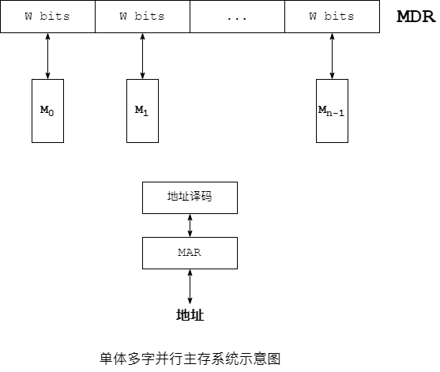
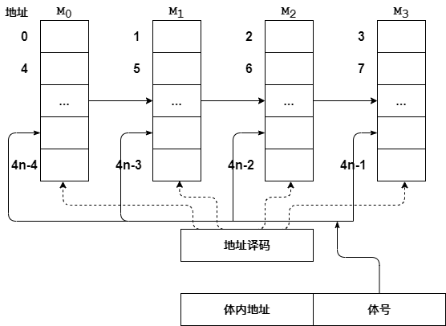
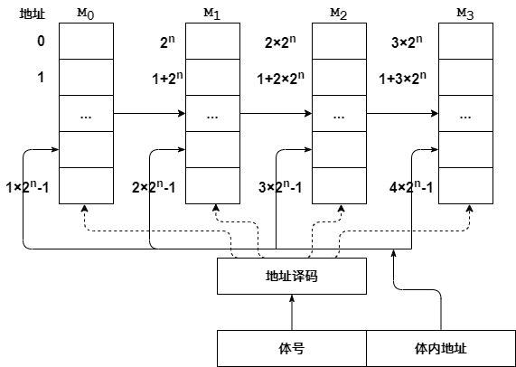

<a id="markdown-1-存储器" name="1-存储器"></a>
# 1. 存储器

<!-- TOC -->

- [1. 存储器](#1-存储器)
  - [1.1. SRAM](#11-sram)
  - [1.2. DRAM](#12-dram)
  - [1.3. Double Port RAM](#13-double-port-ram)
  - [1.4. 多模块存储器](#14-多模块存储器)
    - [1.4.1. 单体多字](#141-单体多字)
    - [1.4.2. 多体交叉](#142-多体交叉)
  - [1.5. Cache](#15-cache)

<!-- /TOC -->
存储器主要分为以下几部分：

1. **层次分类**：
* 主存（内存，main memory）
* 外存（辅存）
* 高速缓冲存储器（cache）

2. **存储介质分类**：
* 磁介质（磁盘、磁带、磁鼓）
* MOS 半导体介质（DRAM，SRAM）
* TTL 半导体介质
* 光存储器（光盘）

3. **存取方式分类**：
* 随机存储器（RAM): SRAM, DRAM
* ROM: MROM, PROM, EPROM, FLASH
* **串行访问存储器**：顺序存储器（磁带）、直接存储器（磁盘）

这里的直接存储器，不像磁带那样完全顺序，也不像 RAM 那样完全随机访问，介于两者之间。

4. **信息的可保存性分类**：
* 易失性存储器（volatile memory）：RAM(SRAM, DRAM)
* 非易失性存储器：ROM、各类外存 

``` 
寄存器 > cache L1 > cache L2 > cache L3 > Main memory > 外存
```

<a id="markdown-11-sram" name="11-sram"></a>
## 1.1. SRAM

SRAM (staic random access memory)，随机存取存储器，random access 指的是给定一个地址 O(1) 时间访问。所谓的“静态”，是指这种存储器只要保持通电，里面储存的数据就可以恒常保持。这也是相对于 DRAM 而言的。

SRAM 保存一个 bit 需要 6 个晶体管。而 DRAM 保存一个 bit 只需要一个电容和一个晶体管。而 DRAM 的数据实际上是存于电容里面的，电容会有电荷的泄漏，损失，所以需要对电容状态进行保持和 refresh 操作，这个操作是 time costly。由此，DRAM 的集成度更高，容量更大，但速度较慢。

一个 SRAM 基本单元有 0 和 1 两个电平稳定状态。SRAM 基本单元由两个 CMOS 反相器组成。两个反相器的输入、输出交叉连接，即第一个反相器的输出连接第二个反相器的输入，第二个反相器的输出连接第一个反相器的输入。这就能实现两个反相器的输出状态的锁定、保存，即储存了 1 个位元的状态。

> SRAM 还有 8 管、10 管甚至每个位元使用更多的晶体管的实现。这可用于实现多端口（port）的读写访问，如显存或者寄存器堆的多口 SRAM 电路的实现。


<a id="markdown-12-dram" name="12-dram"></a>
## 1.2. DRAM

DRAM 主要利用电容内 存储的电荷的多少来代表一个二进制 bit 是 1 还是 0。DRAM 通常以一个电容和一个晶体管为一个单元排成的 **二维矩阵**。DRAM 的地址线分两次传送，即 **行地址** 和 **列地址**，这种方式属于『重合』法驱动。

> SRAM, DRAM 都属于易失性存储器（volatile memory）。


<a id="markdown-13-double-port-ram" name="13-double-port-ram"></a>
## 1.3. Double Port RAM

双端口 RAM，略。


<a id="markdown-14-多模块存储器" name="14-多模块存储器"></a>
## 1.4. 多模块存储器


<a id="markdown-141-单体多字" name="141-单体多字"></a>
### 1.4.1. 单体多字

> https://www.tomorrow.wiki/archives/1113

『单体多字』并行存储器就是将多个存储体并行工作，共用一套 MAR 和 地址编码电路，『单体』意思是将多个存储体视为一个整体。



从图中可以看出：

* CPU 的机器字长为 w bits
* n 个 w bits 存储字长的存储器并行工作
* n 个 存储体共用 MAR 
* MDR 是 $n\times w$ bits

当 CPU 送出 A 地址时，n 个存储体的 A 地址单元被选中，然后一次性与 MDR 交换 $n \times w$ bits 的数据。即一次性读出或写入 $n \times w$ bits 的数据。**然后 CPU 每次都是从 MDR 中读取 w bits，分 n 次读取**。

优点就是，一个存取周期内，从同一地址读取 $m \times w$ 数据，然后一个个送到 CPU，即每隔 1/m 个存取周期，CPU 从 MDR 读取 w bits。这显然增加了存储器的带宽，提高了工作速度。

所以可以看到，指令和数据在内存中必须是**连续存放的**，一旦遇到转移指令，或者操作数不是连续存放的，加速效果就不明显了。


<a id="markdown-142-多体交叉" name="142-多体交叉"></a>
### 1.4.2. 多体交叉

多体并行，也是由多个存储器模块组成，每个模块有相同的存储容量和速度，而且各个模块都有**独立**的读写控制电路、MDR、MAR。它们既可以并行工作，也可以交叉工作。

1. 低位交叉编址




:exclamation: 注意低位交叉编址的地址编号，区别于高位交叉编址。

* 假设 CPU 需要顺序读取地址为 A, A+1, A+2, A+3，并且 A 地址所在的存储体的体号为 0；
* CPU 首先给出 A 地址，A 地址的高位地址 a1 就送到了各个存储体的 MAR，所以此时，所有的存储体被选中的都是 a1 地址单元。
* 然后把各个存储体的 a1 地址单元中的内容读到各自的 MDR【各自都有独立的 MAR 和 MDR，因此是并行读取的】，在 CPU 的工作周期中，此过程是最耗时的
* 此时的低位地址为 a0，也就是选中的体号为 0 的存储体，CPU 直接从 0 号存储体的 MDR 读取
* 接着 CPU 给出 A+1 地址，高位地址不变，低位地址变成 a0+1；
    - 因为高位地址不变，所以**不需要再次从存储器中读取**
    - 低位地址 +1，说明选中的是 1 号存储体，CPU 直接从 1 号存储体的 MDR 读取数据
* CPU 接着给出 A+2, A+3 地址，过程类似

**根据程序的局部性原理**，CPU 给出连续地址是很高概率的情况，而 CPU 工作周期中占用时间最长的正是存储器的存储周期。

因此，低位交叉编址的多体寄存器将多个**连续地址单元**的存储周期并行了，可以很大程度提高 CPU 的工作周期，提供 CPU 与存储器之间的数据交换速率。

> 结合低位交叉编址的地址编号顺序来理解。M0 存储体的 1 地址，M1 存储体的 2 地址的排列情况，很显然是水平连续的。

1. 高位交叉编址



注意高位编址的地址编号顺序。该方式类似 **字扩展** 增加存储容量。高位表示体号，低位表示地址。

很显然，该方式没有并行访问存储体，所以没有提高吞吐率。尤其对于程序的局部性原理来说，没有提高数据交换速率。应用场景受限。


<a id="markdown-15-cache" name="15-cache"></a>
## 1.5. Cache
