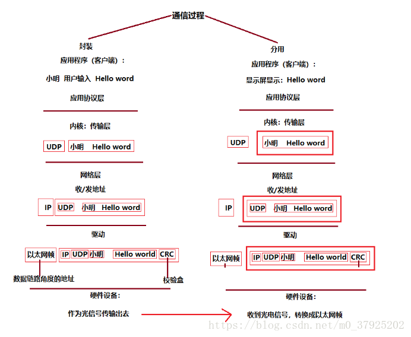

# 套接字

socket，套接字有如下几个定义：

## TCP/UDP 引入套接字

一个 TCP 连接，有两个端点，该端点就『抽象』为套接字（socket）或接口。因此套接字是 IP 地址和 端口号的拼接，可以简单视为一个函数。简单理解为该函数两个参数为 IP 地址和 端口号（当然，后面可以看到套接字其实是一系列 API，即函数）。即
```
Sokcet = (IP 地址:端口号)
```

而 TCP 连接『唯一』的和一个 socket 套接字绑定（这是很显然的，一个连接有两个端口），故而：
```
TCP 连接 ::= {socket1,socket2} = {(IP1:port1),(IP2:port2)}
```

由此可见，套接字就是一种抽象的概念，进程通过套接字来进行网络通信。而且，TCP 连接也是一种抽象，一种由 TCP 协议软件所提供的一种抽象。

套接字随着发展有了更广泛的概念：
1. 运输层和应用层的接口 API，称为 socket API，简称 socket
2. socket API 有一个函数也叫做 socket
3. 还有一些其他的略过

其中第一个概念是最核心的。

> 应当注意在 UDP 连接中也有套接字接口，不局限于 TCP 连接，因为它是一个抽象的概念，和任何运输层协议中应用层进行交互的协议都有关联。

## 网络通信概览

一个最简单的例子，两端进行网络通信，如下所示：



其中，应用层协议通过『套接字』和 UDP 进行交互。


## reference:
1. https://blog.csdn.net/m0_37925202/article/details/80286946
