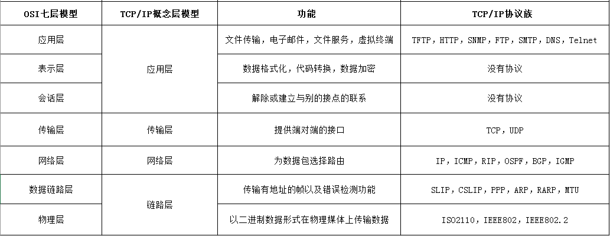
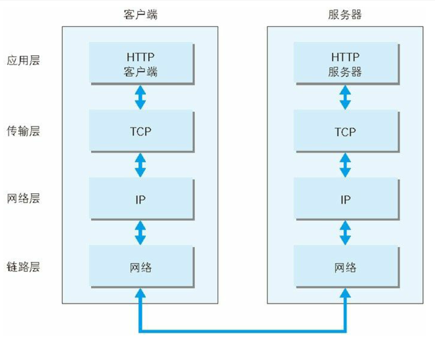
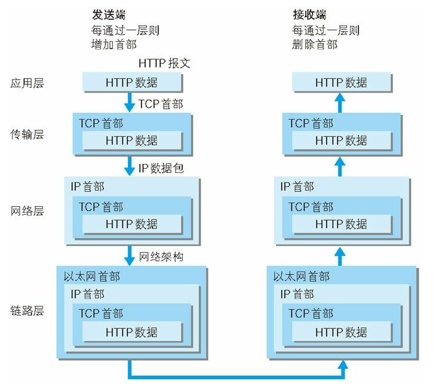

# 计算机网络体系结构

计算机网路的体系结构是分层的，各层及其之间的协议的集合，称之为**网络的体系结构**。

OSI 体系结构：
```
应用层->表示层->会话层->运输层->网络层->数据链路层->物理层
```

TCP/IP 体系结构：
```
应用层->运输层（TCP/UDP）->网际层（IP）->网络接口层
```

五层协议的体系结构：
```
应用层->运输层（传输层）->网络层->数据链路层->物理层
```

1. 计算机体系结构分层模型概览如下



2. TCP/IP 协议族通信概览如下



3. 具体到 HTTP 协议的一个流程概览如下



HTTP 协议的具体流程见 [应用层](应用层.md)


